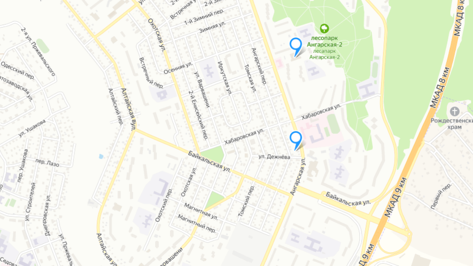

# Map
###### __At first you need to clone our repository and in the terminal whrite comands bellow this:__
## Project Setup

```sh
npm install
```

### Compile and Hot-Reload for Development

```sh
npm run dev
```

### Compile and Minify for Production

```sh
npm run build
```
***
1. ### About project
*  _this project was a training project and was a task from Megafon._
*  *The map is still in beta-version ~~and maybe in the future we will finalize it~~.*
*  ___demo___: 
 


2. ### What features does our project have
> You can use our map and search some adress, that you want to find.


3. ### What  tools we used to develop the map
* The map is work with Yandex maps api (vue-yandex-maps). 
* and writen on _Vue 3_. 
